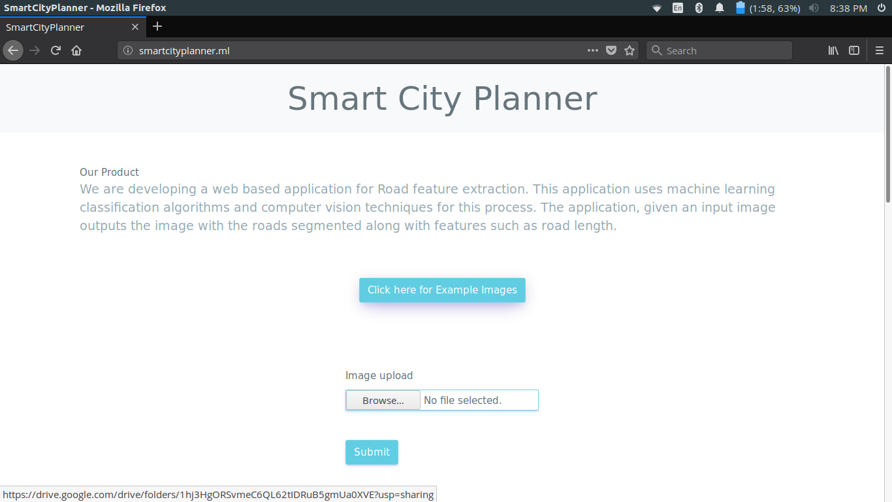
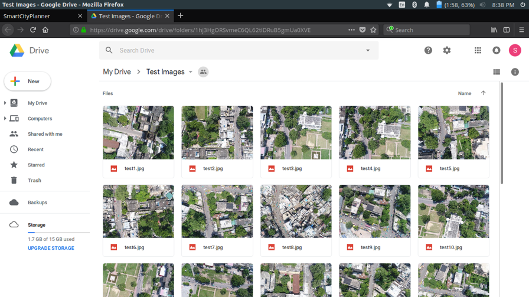
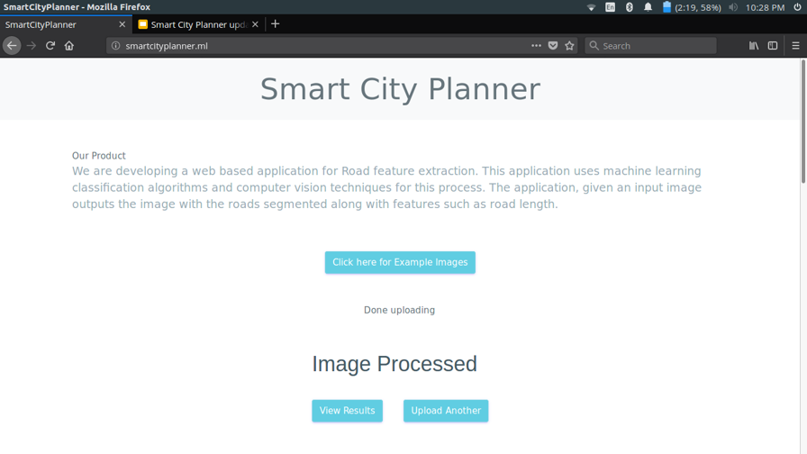
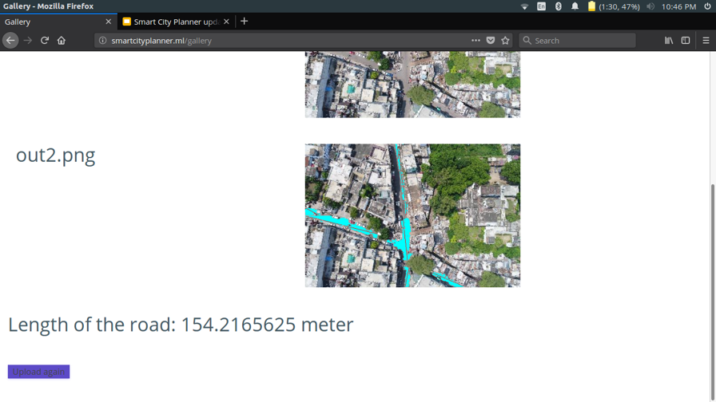
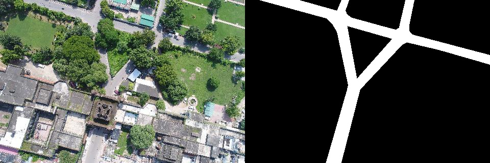
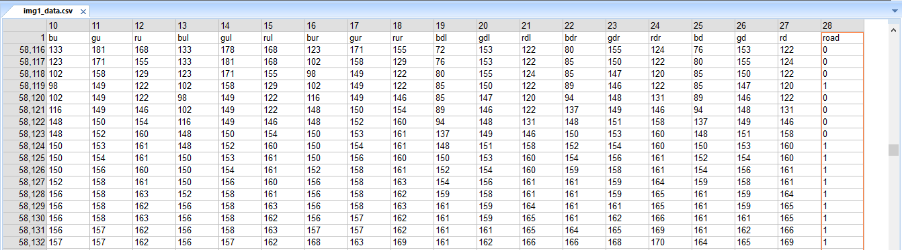
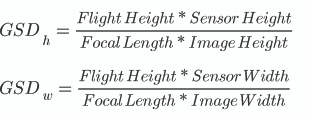

<<<<<<< HEAD
# Road_Segmentation
This is the first in the series of repositories in development of the Smart City Planner research project I have been involved with for the past year.

The goal of this project is to develop a dynamic web application which will ease the process of city planning and development-tracking for the user with minimum effort spent by the user in repetitive processes. With the widespread development in the field of Artificial Intelligence, the aim here is to at least being able to reduce the repetitive processes such as spotting different features in an image to only a computational challenge.

This repository reflects a solution to road detection and road length calculation in images taken from a drone.

## The Application
* On the landing page the user can either upload his/her own images or to test the application the user can use the example test images provided

  

  
* Once uploaded it usually takes 3-5 minutes to process depending on the size of the image

  
* Once done processing the user can view the results by clicking the "View Results" button

  
* The result shows the output image with roads clearly marked along with the length of the road detected

  

## How does it work?
### The Dataset
* The dataset used were a set of 1000 images collected from drones, over various types of Indian settlements.
* Ground Truth was made by masking another blank layer onto the original image and marking each pixel which represented road.

  
* A CSV file with 28 features of each pixel was made for each image. The features being RGB values of the pixel itself along with each of the adjacent pixel. The last column being either 0 or 1 representing road pixel or non-road pixel.

  
* The CSV of 170 such images were combined to form one huge CSV as the training set.

### Machine Learning
* The application uses Random Forest algorithm to detect roads.
* Each pixel of the image goes through a pre-trained Random Forest perceptron, which predicts if the pixel belongs to the road class or the non-road class.
* Connected Component Analysis(CCA) is used to make clusters of
* Though slower than most deep learning techniques, this technique turned out to be much more accurate in the results.

### Length calculation
* The Ground Sample Distance(GSD) for each image is first calculated by extracting the "relative_altitude", "focal_length","sensor_height" and "sensor_width" from exif data of the image and then using the below formula.

* GSD tells us that how much distance(in cm) does each pixel dimension signify. Since pixels are square, minimum of height GSD and width GSD is considered to be the final GSD.
* Connected Component Analysis(CCA) is used to make clusters of pixels where the road was detected. A huge cluster is usually divided into multiple clusters.
* Hough transform is used to fit a mean line to each of these clusters. The width of the line kept at one pixel.
* Now to finally to calculate the length, the GSD is finally multiplied with the total number of pixels forming the mean lines.
* For testing the accuracy of the length, comparisons were made with the length of roads found out from Google Maps for the same area. This was tested for a huge set of images.
* The length turns out to be accurate up to an average variance of 5 meters

## Why not use deep learning algorithms?
### What could have been used...
For such kind of segmentation problems the first thing that comes to mind is that it can be solved with the use of modern deep-learning architectures like Fully Convolutional Network's(FCN's) and Convolutional Neural Network(CNN's). There are deep-learning algorithms that have already been successfully appointed to do the task of image segmentation, some of them being [ResUNet](https://arxiv.org/abs/1711.10684), [U-Net](https://pdfs.semanticscholar.org/0704/5f87709d0b7b998794e9fa912c0aba912281.pdf), [SegNet](https://arxiv.org/pdf/1511.00561.pdf) etc.

[SpaceNet Road Segmentation Challenge](https://medium.com/the-downlinq/spacenet-road-detection-and-routing-challenge-part-i-d4f59d55bfce) is a competition wherein the competitors are challenged to create a model to detect roads given **_satellite_** images, and most of the successful winners usually use some form of FCN. Notice the emphasis on "Satellite" here.

### The target consumer and the problems associated...
The target consumer for our application is municipal authorities and other urban planning committees which do not have access to latest satellite images of an area at their will. Some advanced countries might provide such real time access to these entities, but for a fact this cannot be done in countries like India as of now because most of them have not yet established high resolution surveillance/mapping satellites of their own and have to rely on American Agencies for their data.

Thus drone data comes out to be a viable solution to this problem of automation because flying the drone is a comparatively inexpensive task and does not require much manual labor. Modern drones can easily be tasked to follow waypoints in an area, making the task of collecting data easier and much less challenging for the user.

It is an observation that since drones do not fly very high, we usually get a very high resolution image. In contrast to satellite collected images, drone images end up absorbing much more features and details. The downside to this is the complexity it poses to the algorithm. The classifier has to differentiate among much more features before arriving some form of segmentation.

Upon training and testing a number of Deep-Learning algorithms such as Resnet, ResUnet, Segnet etc on our self-created dataset a common pattern was found. The model was overfitting, it was giving good results on the training data but was performing extremely poorly on the test data. Now this could be due to 2 reasons, either less number of training data or too many features. We concluded the latter to be the case here.

### Conclusion
Thus we stripped everything down to the basics and resorted to some of the traditional techniques used for segmentation. Random Forest ended up being the choice since it gave the most accurate result.
=======
# Road_Segmentation
This is the first in the series of repositories in development of the Smart City Planner research project I have been involved with for the past year.

The goal of this project is to develop a dynamic web application which will ease the process of city planning and development-tracking for the user with minimum effort spent by the user in repetitive processes. With the widespread development in the field of Artificial Intelligence, the aim here is to at least being able to reduce the repetitive processes such as spotting different features in an image to only a computational challenge.

This repository reflects a solution to road detection and road length calculation in images taken from a drone.

## The Application
* On the landing page the user can either upload his/her own images or to test the application the user can use the example test images provided

  

  
* Once uploaded it usually takes 3-5 minutes to process depending on the size of the image

  
* Once done processing the user can view the results by clicking the "View Results" button

  
* The result shows the output image with roads clearly marked along with the length of the road detected

  

## How does it work?
### The Dataset
* The dataset used were a set of 1000 images collected from drones, over various types of Indian settlements.
* Ground Truth was made by masking another blank layer onto the original image and marking each pixel which represented road.

  
* A CSV file with 28 features of each pixel was made for each image. The features being RGB values of the pixel itself along with each of the adjacent pixel. The last column being either 0 or 1 representing road pixel or non-road pixel.

  
* The CSV of 170 such images were combined to form one huge CSV as the training set.

### Machine Learning
* The application uses Random Forest algorithm to detect roads.
* Each pixel of the image goes through a pre-trained Random Forest perceptron, which predicts if the pixel belongs to the road class or the non-road class.
* Connected Component Analysis(CCA) is used to make clusters of
* Though slower than most deep learning techniques, this technique turned out to be much more accurate in the results.

### Length calculation
* The Ground Sample Distance(GSD) for each image is first calculated by extracting the "relative_altitude", "focal_length","sensor_height" and "sensor_width" from exif data of the image and then using the below formula.

* GSD tells us that how much distance(in cm) does each pixel dimension signify. Since pixels are square, minimum of height GSD and width GSD is considered to be the final GSD.
* Connected Component Analysis(CCA) is used to make clusters of pixels where the road was detected. A huge cluster is usually divided into multiple clusters.
* Hough transform is used to fit a mean line to each of these clusters. The width of the line kept at one pixel.
* Now to finally to calculate the length, the GSD is finally multiplied with the total number of pixels forming the mean lines.
* For testing the accuracy of the length, comparisons were made with the length of roads found out from Google Maps for the same area. This was tested for a huge set of images.
* The length turns out to be accurate up to an average variance of 5 meters

## Why not use deep learning algorithms?
### What could have been used...
For such kind of segmentation problems the first thing that comes to mind is that it can be solved with the use of modern deep-learning architectures like Fully Convolutional Network's(FCN's) and Convolutional Neural Network(CNN's). There are deep-learning algorithms that have already been successfully appointed to do the task of image segmentation, some of them being [ResUNet](https://arxiv.org/abs/1711.10684), [U-Net](https://pdfs.semanticscholar.org/0704/5f87709d0b7b998794e9fa912c0aba912281.pdf), [SegNet](https://arxiv.org/pdf/1511.00561.pdf) etc.

[SpaceNet Road Segmentation Challenge](https://medium.com/the-downlinq/spacenet-road-detection-and-routing-challenge-part-i-d4f59d55bfce) is a competition wherein the competitors are challenged to create a model to detect roads given **_satellite_** images, and most of the successful winners usually use some form of FCN. Notice the emphasis on "Satellite" here.

### The target consumer and the problems associated...
The target consumer for our application is municipal authorities and other urban planning committees which do not have access to latest satellite images of an area at their will. Some advanced countries might provide such real time access to these entities, but for a fact this cannot be done in countries like India as of now because most of them have not yet established high resolution surveillance/mapping satellites of their own and have to rely on American Agencies for their data.

Thus drone data comes out to be a viable solution to this problem of automation because flying the drone is a comparatively inexpensive task and does not require much manual labor. Modern drones can easily be tasked to follow waypoints in an area, making the task of collecting data easier and much less challenging for the user.

It is an observation that since drones do not fly very high, we usually get a very high resolution image. In contrast to satellite collected images, drone images end up absorbing much more features and details. The downside to this is the complexity it poses to the algorithm. The classifier has to differentiate among much more features before arriving some form of segmentation.

Upon training and testing a number of Deep-Learning algorithms such as Resnet, ResUnet, Segnet etc on our self-created dataset a common pattern was found. The model was overfitting, it was giving good results on the training data but was performing extremely poorly on the test data. Now this could be due to 2 reasons, either less number of training data or too many features. We concluded the latter to be the case here.

### Conclusion
Thus we stripped everything down to the basics and resorted to some of the traditional techniques used for segmentation.

Random Forest ended up being the choice since it gave the most accurate result.
>>>>>>> 24ce11c01a1010dd1f496dd7e28c764710ec6db1
